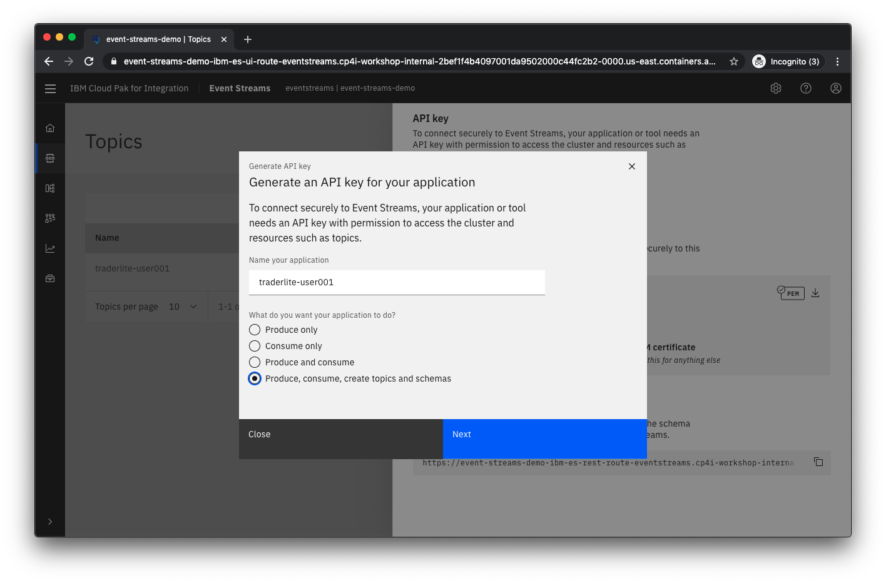
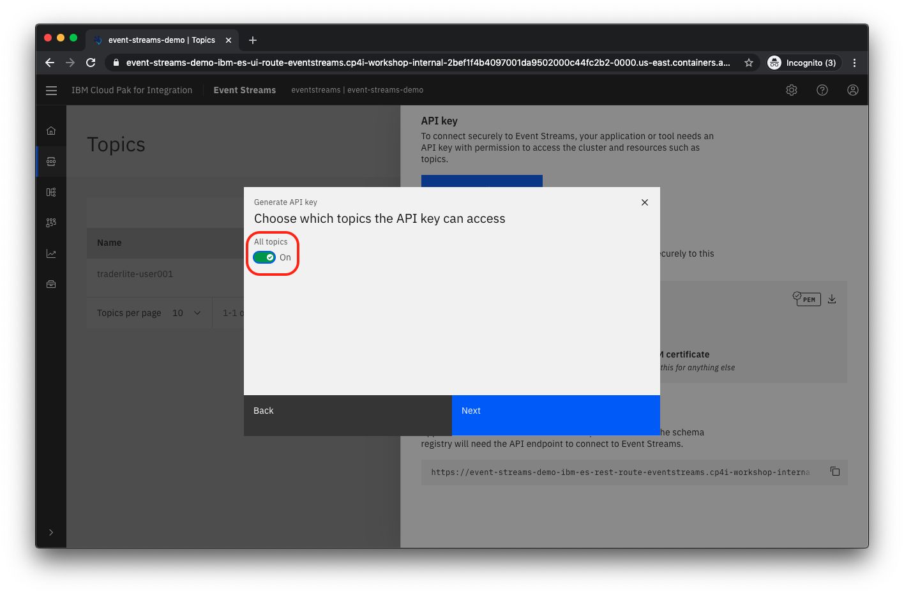

# Lab - Using IBM Event Streams for near realtime data replication

In this lab you will use IBM MQ and IBM Event Streams to replicate data from  a transactional database to a reporting database. The pattern used allows for seamless horizontal scaling to minimize the latency between the  time the transaction is committed to the transactional database and when it is available to be queried in the reporting database.

The architecture of the solution you will build is shown below:


* The **portfolio** microservice sits at the center of the application. This microservice:
   * sends completed transactions to a local IBM MQ queue.
   * calls the **trade-history** service to get aggregated historical trade data.

* The **Kafka Connect** source uses the Kafka Connect framework and an IBM MQ source to consume the  transaction data from IBM MQ and sends it to a topic in Event Streams. By scaling this service horizontally you can decrease the latency between the  time the transaction is committed to the transactional database and when it is available to be queried in the reporting database,

* The **Kafka Connect** sink uses the Kafka Connect framework and a Mongodb sink to receive the transaction data from  Event Streams and  publishes the data to the reporting database. By scaling this service horizontally you can decrease the latency between the  time the transaction is committed to the transactional database and when it is available to be queried in the reporting database.


This lab is broken up into the following steps:

1. [Create a topic in the Event Streams Management Console](#step-1-create-a-topic-in-the-event-streams-management-console)

1. [Get credentials for your Event Streams topic](#step-2-get-credentials-for-your-event-streams-topic)

1. [Upload the Java truststore to the IBM Cloud Shell](#step-3-upload-the-java-truststore-to-the-ibm-cloud-shell)

1. [Add messaging components to the Trader Lite app](#step-4-add-messaging-components-to-the-trader-lite-app)

1. [Generate some test data with the Trader Lite app](#step-5-generate-some-test-data-with-the-trader-lite-app)

1. [Verify transaction data was replicated to the Trade History database](#step-6-verify-transaction-data-was-replicated-to-the-trade-history-database)

1. [Examine the messages sent to your Event Streams topic](#step-7-examine-the-messages-sent-to-your-event-streams-topic)

1. [Summary](#summary)

## Step 1: Create a topic in the Event Streams Management Console

1.1 In a new browser tab open the CP4I **Platform Home** URL provided to you by your instructors.

1.2 Login with your *user???* credentials

1.3 Click on **Skip Welcome**

1.4 Click on **View instances** and then click the link for Event Streams

  

1.5 Click on the **Create a topic** tile

   

1.6 Name the topic `traderlite-user???` where `user???` is your assigned student id. For example if your student id is `user002` then name the topic `traderlite-user002`. Click **Next**.

1.7 Leave the default for the number of partitions and click **Next**.

1.8 Leave the default for message retention and click **Next**.

1.9 Change the Replication factor to 1 and click **Create topic**.

   

1.10 You should see your new topic listed.

## Step 2: Get credentials for your Event Streams topic

2.1 From the Event Streams Management Console click **Connect to this cluster**.

   

2.2 Click on the icon next to the **Bootstrap server** hostname to copy it to the clipboard.

  

2.3 Create a local file and paste the bootstrap server hostname into it.  You'll need this later to connect the Stock Trader Lite application to your Event Streams topic.

2.4 Click **Generate API key**

   

2.5 Name the application `traderlite-user???` where `user???` is your assigned student id. For example if your student id is `user002` then name the application`traderlite-user002`.

2.6 Select **Produce, consume, create topics and schemas** for the capabilities of the API Key. Click **Next**.

  

2.7 Select all topics. Click **Next**.

  

2.8 Click **Generate API key**

2.9 Click **Copy API key** and paste the API Key into the same file that you used to save the bootstrap hostname.

   

2.10 Click on the download icon to download the Java truststore needed for Java applications to connect to Event Streams

   

2.11 This will prompt you to save the file **es-cert.jks** locally. Save the file.

2.12 Keep this browser tab open for later on in the lab.

## Step 3: Upload the Java truststore to the IBM Cloud Shell

3.1 In the IBM Cloud Shell browser tab, click on the upload icon

   

3.2 Select the file **es-cert.jks** that you downloaded in the previous step and follow the prompts to upload it to the IBM Cloud Shell.


## Step 4: Add messaging components to the Trader Lite app

4.1 If you haven't previously cloned the Github repo with the Trader Lite app deployment artifacts, run the following command in the IBM Cloud Shell

```
git clone https://github.com/IBMStockTraderLite/traderlite-cp4i.git
```

4.2 Go to the directory required to run the setup scripts

```
cd traderlite-cp4i/scripts
```

4.3 Run the following command, substituting the Bootstrap hostname and API Key that you saved earlier. Note that the third parameter is the Java truststore file that you just uploaded.

```
./addKafkaIntegration.sh [BOOTSTRAP SERVER HOSTNAME] [YOUR API KEY] ../../es-cert.jks
```
  The output should look like the following:

  ```
  Script being run from correct folder
  Validating student id  ...
  Verifying that Trader Lite is already installed ...
  Found Trader Lite installed in this project
  Using traderlite-user001 as Kafka topic name ...
  Adding secret kafkaconnect-keystore with downloaded Java keystore
  secret/kafkaconnect-keystore created
  Updating Trader Lite  with Kafka Integration ...
  traderlite.operators.clouddragons.com/traderlite patched
  Kafka Integration successful
  Wait for all pods to be in the 'Ready' state before continuing
  ```

4.4 Wait for all the pods to start. Run the following command.

```
oc get pods
```
  Repeat the command until all the pods are in the *Ready* state as shown below:

  ```
NAME                                                   READY   STATUS    RESTARTS   AGE
traderlite-ibm-mq-0                                    1/1     Running   0          46s
traderlite-kafka-connect-standalone-5db97dcd49-lrgls   1/1     Running   0          47s
traderlite-mariadb-0                                   1/1     Running   0          121m
traderlite-mongodb-fd7f6d55b-224vd                     1/1     Running   0          121m
traderlite-operator-6ddd5c4774-l5dcd                   1/1     Running   0          18d
traderlite-portfolio-546d45bf4f-zm2ds                  1/1     Running   0          117m
traderlite-portfolio-74864687f5-gn54p                  1/1     Running   0          46s
traderlite-stock-quote-7965448598-wgxtw                1/1     Running   0          121m
traderlite-trade-history-5648f749c4-cn6th              1/1     Running   0          121m
traderlite-tradr-6cd8d879f4-679q5                      1/1     Running   0          121m
  ```

## Step 5: Generate some test data with the Trader Lite app

5.1 From the command line run the following script:

```
./showTradrUrl.sh
```

5.2 Copy the URL that is output and access it with your browser

5.3 Log in using the username `stock` and the password `trader`

5.4 Click on **Add Client**

  

5.5 Add the client info using valid formats for the Phone Number and email address. Click **Save**.

5.6 Click on the Portfolio ID of the added client

  

5.7 Click **Buy Stock**. Select a company and enter the number of shares. Click **Buy shares**.

5.8 Do 2 or 3 more transactions (either buy or sell).

   


## Step 6: Verify transaction data was replicated to the Trade History database

6.1 From the  IBM Cloud Shell terminal, run the following command to show the Trader History service URL for listing trade data

```
./showHistoryUrl.sh
```

6.2 Copy the URL that is output and access it with your browser

6.3 Verify that trade data in JSON format is shown and the **xactionsrc** fields is set to `Event Streams` indicating that this data was propagated to the Trade History database via IBM MQ and Event Streams.

  

## Step 7: Examine the messages sent to your Event Streams topic

In this step you'll examine the data sent to your Event Streams topic.

7.1 From the Event Streams Management Console click on the topics icon

   

7.2 Click on your topic name

  

7.3 Click on **Messages** and then select an individual message to see the  details.

  

7.4 Details of the message you selected should appear at the right

  


## Summary

Congratulations ! You successfully completed the following key steps in this lab:

* Created an Event Streams topic
* Retrieved all the credentials needed to access the topic from  an application .
* Configured the Trader Lite app to use your topic
* Generated transactions in the Trader Lite app and verified that the data is being replicated via Event Streams.
* Examined messages sent to your topic in the Event Streams Management console.
